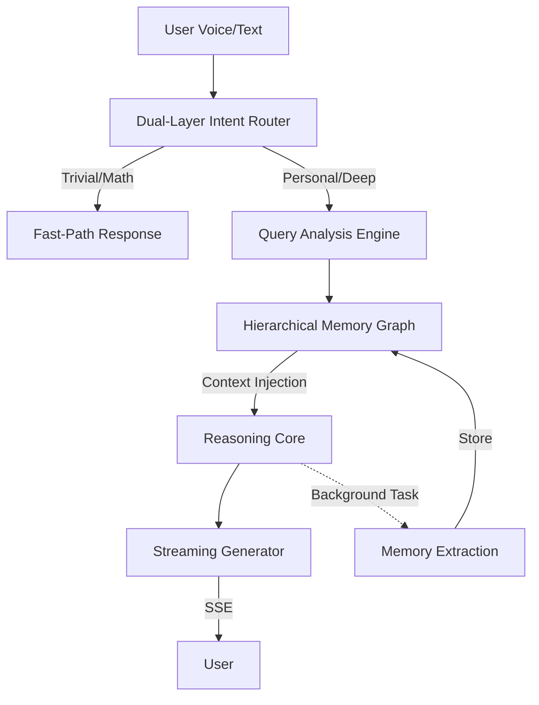

# 🧠 MemoDiary V3: The Empathetic AI Life Companion

[](https://fastapi.tiangolo.com/)
[](https://ai.google.dev/)
[](https://www.sqlite.org/)
[](https://developer.mozilla.org/en-US/docs/Web/JavaScript)

> **"MemoDiary is not just a chatbot; it's a persistent digital extension of your memory."**

### 🌟 The Mission: Tackling LLM Amnesia
A sophisticated, private, and empathetic AI diary that remembers your life. MemoDiary is an asynchronous, Single-Page personal companion application I built to tackle the **LLM Amnesia** problem. It utilizes FastAPI on the backend and pure Vanilla JavaScript on the frontend. 

The core innovation is its **decoupling of live conversational Generation from background Memory Extraction**. When a user speaks via the browser's MediaRecorder API, a custom **Intent Routing layer** filters the query to ensure we aren't wasting LLM tokens or SQLite reads on trivial prompts like math. If it is personal, the backend searches a structured, persistent SQLite **'knowledge graph'**, injects context, and streams text back to the browser using Server-Sent Events, where JS sequentially maps it onto an async audio queue for Text-To-Speech playback. 

I built it specifically to maximize low-latency, scalable AI interaction without expensive NoSQL clouds, demonstrating full-stack proficiency from complex prompt engineering down to bare-metal database index optimization.

---

## 🏆 Why MemoDiary? (The "Vs. Generic LLMs" Edge)

Most people use ChatGPT or Gemini as "temporary consultants." MemoDiary is a **"Permanent Life Companion."** Here is how it outperforms the giants for personal journaling:

| Feature | Generic LLMs (ChatGPT/Gemini) | **MemoDiary V3** |
| :--- | :--- | :--- |
| **Persistence** | Lost after session or hidden in massive history logs. | **Structured Memory Graph** with 100% recall of specific facts. |
| **Privacy** | Data stored in the cloud for training/analysis. | **100% Private.** Local SQLite storage. Your life is yours. |
| **Context Awareness** | Limited by "Context Window." Old chats get "pruned." | **Hierarchical Summaries.** Remembers months/years without lag. |
| **Interaction** | Synchronous (Wait for full response to move on). | **Asynchronous Pipeline.** Generation & Learning decouple. |
| **Proactive Analysis** | Reacts only to your current prompt. | **Trend Extraction.** Identifies patterns in your mood/health. |

### 💡 Real-World Use Cases
- **The "Project Continuity" Problem**: Tell MemoDiary about a project today. Ask about it 6 months later. It remembers the specific hurdles you faced and the logic you used, injected directly into the prompt.
- **The "Emotional Mirror"**: After a month of entries, ask "How has my stress level changed since I started this new job?" MemoDiary queries its **Trend Analysis Engine** and gives you a data-backed reflection.
- **Personalized Advice**: Because it knows your age, health profile, and preferences, its suggestions (like travel plans or habit tracking) are tailored to *you*, not a generic user persona.

---

## 🚀 The Core Innovation: Decoupled Memory Engine

The core breakthrough is its **Asynchronous Pipeline**:
1. **Live Generation**: The user receives a low-latency, empathetic response streamed via **Server-Sent Events (SSE)**.
2. **Background Extraction**: Simultaneously, a non-blocking background task (triggered via `BackgroundTask` or `asyncio`) analyzes the conversation to extract structured facts, update life-stage profiles, and generate hierarchical summaries—all without delaying the user experience.

### Intelligence Architecture


---

## 💎 Key Intelligence Pillars

### 1. Dual-Layer Intent Routing
To maximize token efficiency and minimize latency, MemoDiary employs a two-tier routing system:
- **Fast-Router (Regex/Rules)**: Instantly handles trivial math, greetings, and simple queries without wasting tokens on the heavy LLM.
- **Deep-Router (LLM-based)**: Analyzes complex queries to determine if they require **Personal Recall**, **Trend Analysis**, **Date-Specific Retrieval**, or **General World Knowledge**.

### 2. Hierarchical Memory Graph
Unlike simple "chat history" systems, MemoDiary stores knowledge in a structured hierarchy:
- **Fact Cache**: Specific key-value facts (e.g., "Favorite Coffee: Espresso").
- **Life Profiles**: Persistent states for domains like Health, Career, and Personal Projects.
- **Temporal Summaries**: Daily, Weekly, and Monthly hierarchical recaps that allow the AI to "remember" years of history without context-window overflow.

### 3. Multi-Modal interaction
- **Whisper/Gemini Integration**: High-fidelity audio transcription via the `MediaRecorder` API.
- **Neural TTS Engine**: Sequential audio mapping for natural-sounding, low-latency playback.

---

## 🔬 System Logic: Step-by-Step
To achieve "Human-like" memory with "Machine-like" precision, the system follows this workflow:

1. **Acoustic Processing**: Audio is captured via `MediaRecorder` and sent to the `/api/transcribe` endpoint (Whisper-powered).
2. **Intent Classification**:
    - **Trivial Layer**: Checks for math/greetings via Regex (0.01ms latency).
    - **Contextual Layer**: LLM determines if the user is asking a *Personal Question*, a *General Fact*, or just *Sharing a Feeling*.
3. **Contextual Injection**:
    - If "Personal", the system queries the SQLite `memory_items` table using optimized indices on `session_id` and `memory_key`.
    - It reconstructs a "Relevant Life Context" block to inject into the LLM system prompt.
4. **Streaming Inference**: SSE streams the response. JS maps tokens to an audio queue, ensuring the AI "talks" while it "thinks."
5. **Background Learning**: Post-response, the conversation is archived and a separate LLM pass extracts new facts to be stored/updated in the Knowledge Graph.

---

## 🛡️ Privacy Architecture: Zero-Cloud Footprint
Most "AI Companions" harvest your data to train their models. MemoDiary is built on a **Zero-Cloud Memory** principle:
- **Local Persistence**: All diary entries and extracted facts are stored in a local `memodiary.db` file.
- **Data Isolation**: Each user session is cryptographically separated. No data leaks between sessions.
- **Index Optimization**: We use `B-Tree` indexing on temporal and categorical columns, ensuring that even with 10,000+ entries, recall remains sub-100ms.

---

## 🛠️ Technical Stack

- **Backend**: FastAPI (Python 3.8+)
- **AI Models**: Groq (Llama-3.3-70b/8b) & Google Gemini (Multi-Key Rotation Support)
- **Database**: SQLite with custom indexing for temporal queries.
- **Frontend**: Pure Vanilla JavaScript (No React/Vue overhead).
- **Communication**: Asynchronous Server-Sent Events (SSE).

---

## 📋 Prerequisites
- Python 3.8+
- [Google AI Studio API Key](https://aistudio.google.com/) or [Groq API Key](https://console.groq.com/)

## ⚙️ Quick Start

### 1. Clone & Setup
```powershell
git clone https://github.com/your-repo/MemoDiary.git
cd MemoDiary
python -m venv venv
.\venv\Scripts\activate
```

### 2. Install Dependencies
```powershell
pip install -r requirements.txt
```

### 3. Environment Configuration
Create a `.env` file in the root:
```env
GEMINI_API_KEY=your_key_here
# Optional for higher throughput
GROQ_API_KEY=your_groq_key_here
```

### 4. Launch the Brain
```powershell
uvicorn app.main:app --reload --host 0.0.0.0 --port 8000
```
Visit `http://localhost:8000` to meet **Memo**.

---

## 🛡️ Admin & Security
- **Secure PIN Auth**: Access the internal analytics and memory audit layer at `/api/admin/stats`.
- **Privacy Mode**: All diary entries are stored locally; your life remains yours.

---

Built with ❤️ by [Your Name/Handle]
*Demonstrating full-stack proficiency from complex prompt engineering down to bare-metal database index optimization.*
