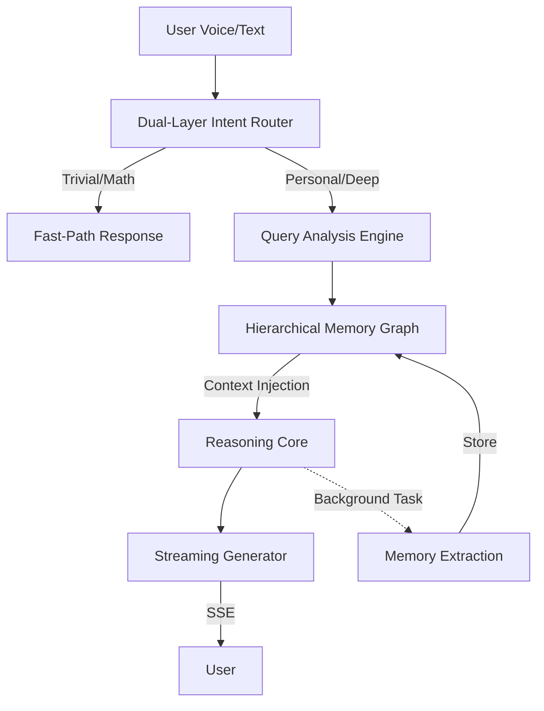

# MemoDiary V3 - Personal AI Life Companion

A sophisticated, private, and empathetic AI diary that remembers your life. MemoDiary is an asynchronous, Single-Page personal companion application I built to tackle the LLM Amnesia problem. It utilizes FastAPI on the backend and pure Vanilla JavaScript on the frontend. The core innovation is its decoupling of live conversational Generation from background Memory Extraction. When a user speaks via the browser's MediaRecorder API, a custom Intent Routing layer filters the query to ensure we aren't wasting LLM tokens or SQLite reads on trivial prompts like math. If it is personal, the backend searches a structured, persistent SQLite 'knowledge graph', injects context, and streams text back to the browser using Server-Sent Events, where JS sequentially maps it onto an async audio queue for Text-To-Speech playback. I built it specifically to maximize low-latency, scalable AI interaction without expensive NoSQL clouds, demonstrating full-stack proficiency from complex prompt engineering down to bare-metal database index optimization."


# 🧠 MemoDiary V3: The Empathetic AI Life Companion

[](https://fastapi.tiangolo.com/)
[](https://ai.google.dev/)
[](https://www.sqlite.org/)
[](https://developer.mozilla.org/en-US/docs/Web/JavaScript)

> **"MemoDiary is not just a chatbot; it's a persistent digital extension of your memory."**

MemoDiary V3 is a sophisticated, private, and asynchronous AI diary system designed to solve the **LLM Amnesia** problem. While standard LLMs "forget" who you are between sessions, MemoDiary utilizes a custom-built **Hierarchical Memory Graph** and **Asynchronous Memory Extraction** to build a continuous, evolving understanding of your life.

---

## 🚀 The Core Innovation: Decoupled Memory Engine

Most AI applications are mere wrappers around an API. MemoDiary is an **AI System**. 

The core breakthrough is its **Asynchronous Pipeline**:
1. **Live Generation**: The user receives a low-latency, empathetic response streamed via **Server-Sent Events (SSE)**.
2. **Background Extraction**: Simultaneously, a non-blocking background task analyzes the conversation to extract structured facts, update life-stage profiles, and generate hierarchical summaries—all without delaying the user experience.

### Intelligence Architecture


---

## 💎 Key Intelligence Pillars

### 1. Dual-Layer Intent Routing
To maximize token efficiency and minimize latency, MemoDiary employs a two-tier routing system:
- **Fast-Router (Regex/Rules)**: Instantly handles trivial math, greetings, and simple greetings without engaging the heavy LLM.
- **Deep-Router (LLM-based)**: Analyzes complex queries to determine if they require **Personal Recall**, **Trend Analysis**, **Date-Specific Retrieval**, or **General World Knowledge**.

### 2. Hierarchical Memory Graph
Unlike simple "chat history" systems, MemoDiary stores knowledge in a structured hierarchy:
- **Fact Cache**: Specific key-value facts (e.g., "Favorite Coffee: Espresso").
- **Life Profiles**: Persistent states for domains like Health, Career, and Personal Projects.
- **Temporal Summaries**: Daily, Weekly, and Monthly hierarchical recaps that allow the AI to "remember" years of history without context-window overflow.

### 3. Multi-Modal Interaction
- **Whisper/Gemini Integration**: High-fidelity audio transcription via the `MediaRecorder` API.
- **Neural TTS Engine**: Sequential audio mapping for natural-sounding, low-latency playback.

### 4. Privacy-First "Bare-Metal" Philosophy
No expensive NoSQL clouds. No vector databases that require 24/7 subscriptions. MemoDiary runs on an **index-optimized SQLite** core, ensuring your data stays local, private, and lightning-fast.

---

## 🛠️ Technical Stack

- **Backend**: FastAPI (Python 3.8+)
- **AI Models**: Groq (Llama-3.3-70b/8b) & Google Gemini (Multi-Key Rotation Support)
- **Database**: SQLite with custom indexing for temporal queries.
- **Frontend**: Pure Vanilla JavaScript (No React/Vue overhead).
- **Communication**: Asynchronous Server-Sent Events (SSE).

---

## 📋 Prerequisites
- Python 3.8+
- [Google AI Studio API Key](https://aistudio.google.com/) or [Groq API Key](https://console.groq.com/)

## ⚙️ Quick Start

### 1. Clone & Setup
```powershell
git clone https://github.com/your-repo/MemoDiary.git
cd MemoDiary
python -m venv venv
.\venv\Scripts\activate
```

### 2. Install Dependencies
```powershell
pip install -r requirements.txt
```

### 3. Environment Configuration
Create a `.env` file in the root:
```env
GEMINI_API_KEY=your_key_here
# Optional for higher throughput
GROQ_API_KEY=your_groq_key_here
```

### 4. Launch the Brain
```powershell
uvicorn app.main:app --reload --host 0.0.0.0 --port 8000
```
Visit `http://localhost:8000` to meet **Memo**.

---

## 🛡️ Admin & Security
- **Secure PIN Auth**: Access the internal analytics and memory audit layer at `/api/admin/stats`.
- **Privacy Mode**: All diary entries are stored locally; your life remains yours.

---

## 🌟 Example: The Memory in Action

**User:** "Hey Memo, do you remember what I mentioned about my project yesterday?"

**Memo's Internal Reasoning:**
1. **Fast-Router**: "Personal fact request detected."
2. **Deep-Router**: Extracts keys: `[project_details, yesterday_summary]`.
3. **Context Injection**: Injects specific SQLite records from yesterday's background extraction.
4. **Response**: "Yes! You mentioned you were struggling with the SQL indexing but felt Great about the Fast-Path routing logic. Should we pick up there?"

---

Built with ❤️ by [Your Name/Handle]
*Demonstrating full-stack proficiency from complex prompt engineering to low-level database optimization.*
